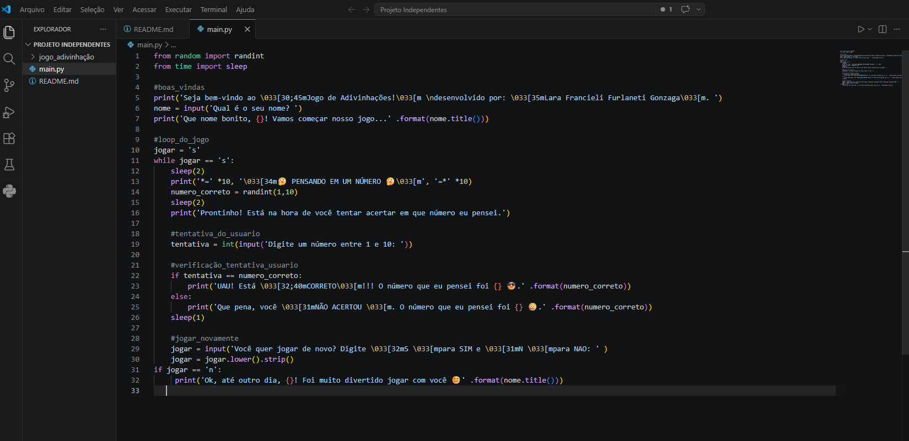

# Jogo de Adivinhação em Python

Este é um jogo simples desenvolvido em Python onde o usuário tenta adivinhar um número aleatório gerado pelo sistema.

##  Funcionalidades

- Geração de número aleatório entre 1 e 10  
- Interação com o usuário via terminal  
- Verificação de acerto ou erro  
- Opção de jogar novamente  

##  Tecnologias utilizadas

- Python  
- Biblioteca `random`  
- Biblioteca `time` 

## Como executar
1. Execute o arquivo main.py
2. Responder as perguntas